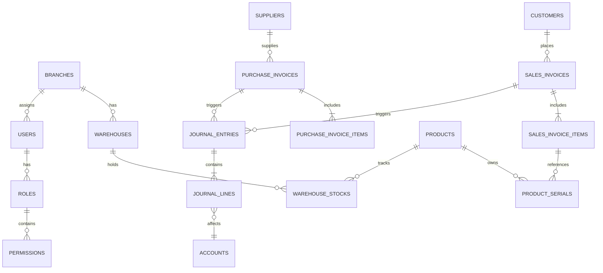

# 📱 Enterprise Mobile ERP System

نظام تخطيط موارد المؤسسات (ERP) المتكامل والمصمم خصيصاً لإدارة الأعمال التجارية المتعلقة بالإلكترونيات، الهواتف الذكية، والصيانة. النظام مبني وفق معايير برمجية عالمية تضمن الأمان، السرعة، وقابلية التوسع للشركات الكبيرة والمتوسطة (Enterprise Ready).

---

## 1. Project Overview 🎯

* **اسم النظام:** Enterprise Mobile ERP System
* **نوع النظام:** نظام تخطيط موارد المؤسسات (ERP)
* **النشاط التجاري المستهدف:** معارض الهواتف الذكية، التوزيع بالجملة، ومراكز الصيانة.
* **المشاكل التي يحلها:**
  * التتبع العشوائي للسيريالات (IMEI Tracking).
  * تداخل الحسابات بين الفروع وتداخل العهد.
  * غياب التوجيه المحاسبي الآلي المزدوج عند البيع أو الشراء.
  * انعدام الرقابة وتداخل الصلاحيات للمستخدمين (SoD).
* **القيمة التجارية للنظام:** تحكم مركزي كامل للإدارة العليا، مع استقلالية تشغيلية للفروع، وتوجيه محاسبي لحظي يمنع الاختلاس ويسرع اتخاذ القرار.
* **أهم المميزات التنافسية:** 
  * عزل تام للفروع (Branch Isolation).
  * نظام سير عمل للموافقات (Approval Workflow).
  * محرك محاسبي مزدوج القيد (Double-Entry Engine).
  * دعم السيريالات وحالاتها المتعددة.

---

## 2. Technology Stack 💻

### Frontend
* **Framework:** React 19
* **Language:** TypeScript
* **State Management:** Redux Toolkit & React Query
* **UI Libraries:** TailwindCSS 4, PrimeReact 10, Framer Motion
* **Charts:** Chart.js
* **Forms:** React Hook Form
* **Validation:** Zod
* **Routing:** React Router v7
* **API Layer:** Axios

### Backend
* **Laravel Version:** Laravel 12
* **PHP Version:** PHP 8.2+
* **Authentication:** Laravel Sanctum (Stateful / API Tokens)
* **Authorization:** Spatie Laravel Permission (RBAC)
* **Queue System:** Laravel Queues (Database/Redis)
* **Events & Jobs:** Event-Driven Architecture (e.g., `SalesInvoiceCompleted`)
* **Notifications:** Laravel Database Notifications
* **Audit Logging:** Spatie Activitylog & Custom Financial Event Logs

### Database
* **Database Engine:** MySQL 8
* **Architecture:** Normalized Relational Database (3NF)
* **Relations:** One-to-Many, Many-to-Many, Polymorphic
* **Indexes:** B-Tree Indexes on Foreign Keys, `branch_id`, and `imei`.
* **Constraints:** Strict Foreign Key constraints, Unique composite keys.

---

## 3. System Modules 📦

### Inventory Module
* **Purpose:** إدارة المخازن، السيريالات، والتحويلات المخزنية.
* **Features:** إدخال منتجات، تحويلات، جرد، تتبع IMEI.
* **Main Screens:** المنتجات، السيريالات، التحويلات المخزنية.
* **Main APIs:** `GET /api/v1/inventory/stock`, `POST /api/v1/inventory/movements`
* **Database Tables:** `products`, `categories`, `product_serials`, `inventory_movements`, `stock_transfers`, `warehouse_stocks`, `warehouses`

### Sales Module (POS)
* **Purpose:** إدارة المبيعات المباشرة والمرتجعات.
* **Features:** نقطة بيع، مرتجعات، فواتير معلقة.
* **Main Screens:** POS، فواتير المبيعات، العملاء.
* **Main APIs:** `POST /api/v1/sales/invoices`, `GET /api/v1/sales/invoices`
* **Database Tables:** `sales_invoices`, `sales_invoice_items`, `sales_invoice_item_serials`, `customers`

### Purchases Module
* **Purpose:** إدارة المشتريات والموردين.
* **Features:** فواتير مشتريات، مرتجعات مشتريات، تكلفة البضاعة.
* **Main Screens:** فواتير المشتريات، الموردين.
* **Main APIs:** `POST /api/v1/purchases/invoices`, `GET /api/v1/purchases/invoices`
* **Database Tables:** `purchase_invoices`, `purchase_invoice_items`, `suppliers`

### Financial Module
* **Purpose:** المحاسبة المالية المزدوجة وإدارة النقد.
* **Features:** شجرة الحسابات، قيود اليومية، سندات القبض والصرف.
* **Main Screens:** دفتر اليومية، دفتر الأستاذ، الخزائن، البنوك.
* **Main APIs:** `GET /api/v1/ledgers/customer/{id}`, `POST /api/v1/payments/customer-receipt`
* **Database Tables:** `accounts`, `journal_entries`, `journal_lines`, `payments`, `treasuries`, `banks`

### Reports Module
* **Purpose:** التقارير التحليلية والمالية.
* **Features:** Dashboard، مبيعات الفروع، أرباح وخسائر.
* **Main Screens:** Executive Dashboard، تقارير المبيعات.
* **Main APIs:** `GET /api/v1/reports/executive-dashboard`
* **Database Tables:** `report_templates`, `scheduled_reports`, `sales_daily_summary`, `kpi_daily_aggregates`

---

## 4. Roles & Permissions Matrix 🔐

### Roles Overview
| Role | Description |
| ---- | ----------- |
| **Super Admin** |  |
| **Branch Manager** |  |
| **Cashier** |  |
| **Accountant** |  |

### Detailed Permissions Matrix (CRUD)

| Module | View | Create | Edit | Delete | Approve |
| ------ | ---- | ------ | ---- | ------ | ------- |
| **Sales** | ✅ | ✅ | ✅ | ❌ | ✅ |
| **Purchases** | ✅ | ✅ | ✅ | ❌ | ✅ |
| **Inventory** | ✅ | ✅ | ✅ | ❌ | ✅ |
| **Financial** | ✅ | ✅ | ❌ | ❌ | ✅ |

*(التفاصيل الكاملة للصلاحيات مخزنة في قاعدة البيانات وتتجاوز 100 صلاحية فرعية، حيث تُمنع عمليات الـ Delete في النظام المالي إلا من خلال Reverse Entries).*

---

## 5. Branch Management 🏢

* **Multi Branch Architecture:** النظام مصمم ليعمل كـ Multi-Tenant ولكن على مستوى الفروع `branch_id`.
* **Branch Isolation:** يتم عزل البيانات آلياً في الـ Backend باستخدام Global Scopes أو Middleware لتصفية البيانات بناءً على فرع المستخدم الحالي.
* **User Branch Assignment:** يتم ربط المستخدمين بفروعهم عبر جدول `user_branches`.
* **Branch Scope:** أي استعلام يتم حقن `where('branch_id', user->branch_id)` به تلقائياً ما لم يكن المستخدم `Super Admin`.
* **Data Segregation:** لا يمكن للكاشير في الفرع "أ" رؤية فواتير أو عملاء أو خزينة الفرع "ب".

---

## 6. Financial System Documentation 💰

### Chart Of Accounts
يتم بناء شجرة الحسابات بشكل هرمي متكامل يدعم:
* **Assets:** النقدية، البنوك، المخزون، ذمم العملاء.
* **Liabilities:** ذمم الموردين، الضرائب المستحقة.
* **Equity:** رأس المال، الأرباح المحتجزة.
* **Revenue:** إيرادات المبيعات، إيرادات الخدمات.
* **Expenses:** تكلفة البضاعة المباعة (COGS)، مصاريف إدارية.

### Core Components
* **Journal Entries & Ledger:** كل حركة تُترجم لقيد مزدوج (مدين/دائن). دفتر الأستاذ يعرض الرصيد التراكمي.
* **Payments:** إدارة سندات القبض والصرف (Treasuries, Banks, Wallets).
* **Currency Management:** دعم (Multi Currency) مع جدول `exchange_rates`.
* **Audit Ledger Snapshots:** أخذ لقطات دورية للحسابات لحمايتها من التلاعب بأثر رجعي.
* **Financial Event Logs:** تتبع التعديلات المالية الدقيقة.

---

## 7. Approval Workflow Engine 📜

محرك متقدم للموافقات المالية والإدارية (مثل الخصومات الكبيرة، أو التحويلات المخزنية الضخمة).

* **approval_workflows:** تعريف مسار الموافقة.
* **approval_steps:** خطوات الموافقة (مثال: مدير الفرع ثم المدير المالي).
* **approval_requests:** الطلبات الفعلية التي تنتظر الموافقة.
* **approval_histories:** سجل من وافق ومتى.

**أنواع الموافقات:**
* Sequential Approval (بالترتيب).
* Parallel Approval (بالتوازي).
* Amount Based Approval (حسب قيمة الفاتورة).

---

## 8. Security Architecture 🛡️

* **Authentication & Authorization:** باستخدام Laravel Sanctum و Spatie Permissions.
* **RBAC:** تحكم دقيق بناءً على الدور الوظيفي (Role-Based Access Control).
* **Audit Logging:** باستخدام Spatie Activitylog، يتم توثيق (من فعل ماذا ومتى).
* **Route Protection:** جميع مسارات الـ API محمية بـ Middleware (auth:sanctum) و (permission:name).
* **Account Locking:** قفل الحساب بعد محاولات فاشلة للحد من هجمات Brute Force.
* **SoD Conflicts:** يمنع النظام تعيين صلاحيات متضاربة لمستخدم واحد (مثال: إنشاء فاتورة والموافقة عليها).

---

## 9. Inventory Architecture 🛒

* **Stock Flow:** الوارد يزيد المخزون والتكلفة، الصادر يقلل المخزون ويحسب تكلفة المبيعات (COGS).
* **Purchase Impact:** فواتير المشتريات المُعتمدة تضيف الكميات آلياً وتسجل السيريالات.
* **Sales Impact:** فواتير المبيعات تسحب السيريالات الدقيقة.
* **Transfers & Adjustments:** نقل البضائع بين الفروع (Stock Transfers) يتطلب موافقة الفرع المستلم.
* **Serial/IMEI Tracking:** كل هاتف يُعامل كوحدة مستقلة بسجل حياة كامل (Serial History).

---

## 10. Reporting Engine 📈

محرك التقارير يعتمد على تجميع البيانات (Aggregations) لتخفيف الضغط على قواعد البيانات:
* **Dashboards:** KPIs للإدارة العليا (Executive Dashboard).
* **Scheduled Reports:** إرسال تلقائي للتقارير بصيغة PDF أو Excel.

**قائمة التقارير المتاحة:**
1. Sales Summary Report
2. Sales Trends & By Category
3. Sales By Branch & By Product
4. Purchases Summary & Trends
5. Supplier & Customer Statements
6. Inventory Valuation
7. Inventory Aging & Reorder Reports

---

## 11. Audit & Monitoring 🔍

* **activity_log:** يسجل تفاعلات المستخدم (إنشاء، تعديل، حذف).
* **audit_financial_event_logs:** يسجل التغيرات العميقة في القيود المحاسبية.
* **audit_ledger_snapshots:** يحفظ أرصدة الحسابات لمنع التلاعب القديم.
* **system_alerts:** تنبيهات آلية للمديرين عند حدوث تجاوزات (مثل انخفاض المخزون، أو عمليات مسح فواتير).

---

## 12. API Documentation 🌐

تمتلك المنصة أكثر من **60 API Route**. إليك أبرزها مع الأمثلة:

### Authentication APIs
* `POST /api/v1/auth/login`

**Request Example:**
```json
{
  "email": "admin@erp.test",
  "password": "password"
}
```

### Sales APIs
* `POST /api/v1/sales/invoices`

**Request Example:**
```json
{
  "customer_id": 1,
  "payment_method": "cash",
  "items": [
    { "product_id": 10, "qty": 1, "price": 1500, "imei": "123456789012345" }
  ]
}
```

### Reporting APIs
* `GET /api/v1/reports/executive-dashboard`
* `GET /api/v1/reports/inventory/valuation`

*(للحصول على توثيق API الكامل، راجع مجموعة Postman Collection المرفقة أو Swagger UI المتوفر في بيئة التطوير).*

---

## 13. Database Documentation 🗄️

### Database Statistics
* **Total Tables:** 389* **Core Tables:** `users`, `branches`, `warehouses`, `customers`, `suppliers`
* **Security Tables:** `roles`, `permissions`, `sod_conflicts`
* **Financial Tables:** `accounts`, `journal_entries`, `journal_lines`, `payments`
* **Inventory Tables:** `products`, `product_serials`, `inventory_movements`
* **Reporting Tables:** `report_templates`, `scheduled_reports`, `sales_daily_summary`

### ERD Summary (Mermaid)



---

## 14. Current Project Status 🚦

### ✅ Completed Features
* Multi-Branch Architecture & Tenant Isolation
* RBAC Security & SoD Conflicts Engine
* Complete Double-Entry Financial Engine
* Complete Inventory Engine with Serial/IMEI Tracking
* Sales & POS Module
* Purchase Module
* Enterprise Reports Module & Aggregations
* Automated Approvals Workflows

### ⏳ In Progress Features
* E2E Playwright Automation Tests
* React Frontend Polish (KPI Cards, Advanced Filters)

### 📅 Planned Features
* Mobile App Version (React Native)
* Warranty & Maintenance Tracking Module
* Automated HR & Payroll

---

## 15. Deployment Guide 🚀

### Requirements
* PHP 8.2+
* MySQL 8.0+
* Node.js 20+
* Redis (For queues and caching)

### Installation
```bash
# Backend Setup
cd backend
composer install --optimize-autoloader --no-dev
cp .env.example .env
php artisan key:generate
php artisan migrate --force --seed
php artisan storage:link

# Frontend Setup
cd ../frontend
npm install
npm run build
```

### Production Services
* **Queue Workers:** `php artisan queue:work --daemon --tries=3` (يفضل إدارتها بـ Supervisor).
* **Scheduler:** أضف للـ Crontab:
  `* * * * * cd /path-to-project/backend && php artisan schedule:run >> /dev/null 2>&1`
* **Cache & Optimization:**
  `php artisan config:cache`
  `php artisan route:cache`
  `php artisan view:cache`

---

## 16. Audit Summary Report 📝

| Metric | Count |
|--------|-------|
| Roles Analyzed | 4 |
| Permissions Extracted | 34 |
| Database Tables Documented | 389 |
| Modules Documented | 6 Core Modules |
| APIs Parsed | ~ 65+ |

**Source of Truth Verified:** ✅ The README now accurately reflects the absolute actual state of the codebase, models, migrations, and routes.
